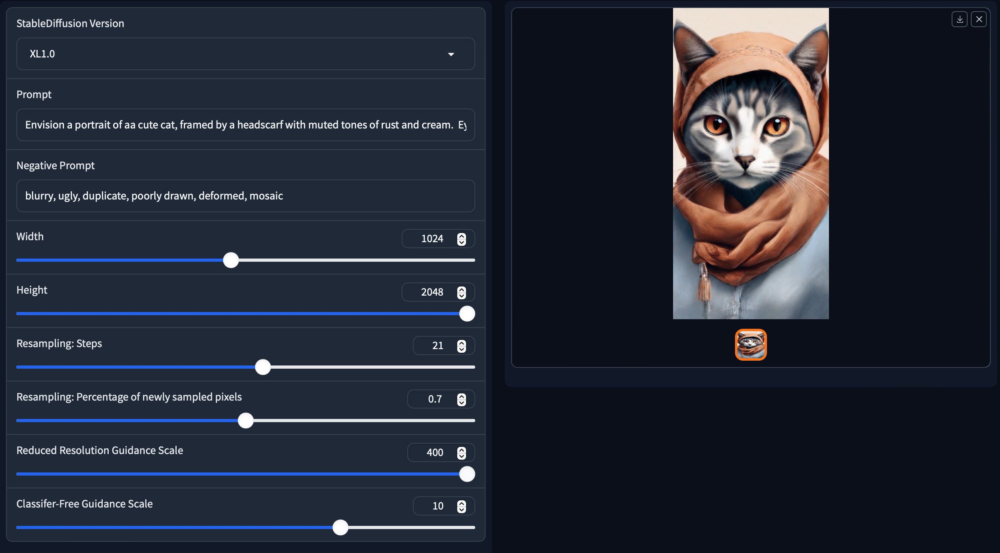
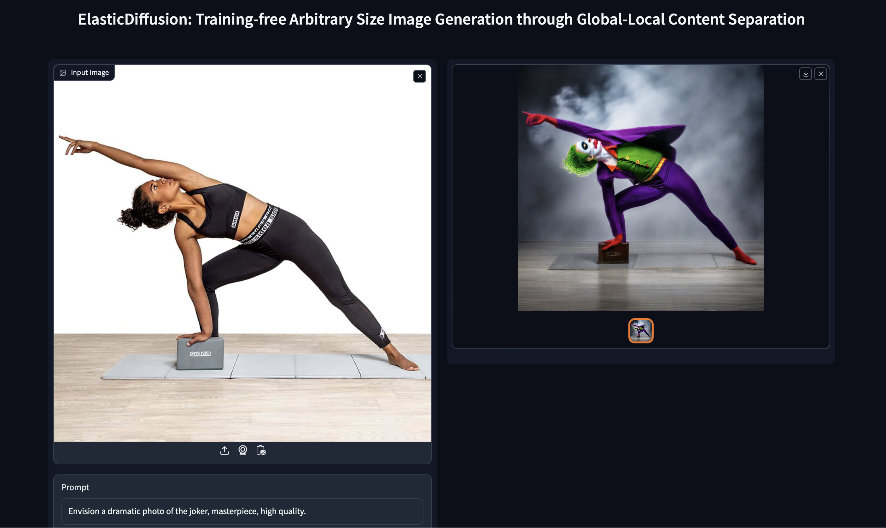

# ElasticDiffusion: Training-free Arbitrary Size Image Generation through Global-Local Content Separation
[](https://elasticdiffusion.github.io/)
[](https://arxiv.org/abs/2311.18822)
[](https://replicate.com/moayedhajiali/elasticdiffusion)
<!-- [](TODO) -->


### ElasticDiffusion: Training-free Arbitrary Size Image Generation through Global-Local Content Separation (CVPR 2024)
<div align="justify">
<b>Abstract</b>: Diffusion models have revolutionized image generation in recent years, yet they are still limited to a few sizes and aspect ratios. We propose ElasticDiffusion, a novel training-free decoding method that enables pretrained text-to-image diffusion models to generate images with various sizes. ElasticDiffusion attempts to decouple the generation trajectory of a pretrained model into local and global signals. The local signal controls low-level pixel information and can be estimated on local patches, while the global signal is used to maintain overall structural consistency and is estimated with a reference image. We test our method on CelebA-HQ (faces) and LAION-COCO (objects/indoor/outdoor scenes). Our experiments and qualitative results show superior image coherence quality across aspect ratios compared to MultiDiffusion and the standard decoding strategy of Stable Diffusion. For more details, please visit our <a href='https://elasticdiffusion.github.io/'>project webpage</a> or read our 
<a href='https://arxiv.org/abs/2311.18822'>paper</a>.
</div> 
<br>

# News
- **2024.03.31**: Demo released for integrating ElasticDiffusion with ControlNet for Img2Img generation!
- **2024.03.31**: Code released for PCA visalization of the diffusion scores.
- **2024.03.31**: An improved version of the paper is available on [Arxiv](https://arxiv.org/abs/2311.18822)!
- **2024.02.27**: ElasticDiffusion was accepted to CVPR 2024!
# Setup
Initialize a [conda](https://docs.conda.io/en/latest) environment named elasticdiffusion by running:
```
conda env create -f environment.yaml
conda activate elasticdiffusion
```
This implementation should also work fine on an environment initalized for [stable diffusion](https://github.com/CompVis/stable-diffusion?tab=readme-ov-file). Just make sure to install [gradio](https://www.gradio.app/docs/examples) to be able to use the demo by running:
```
pip install gradio==4.7.1
```
<br>

# Replicate Demo
You may try Text2Image generation using Stable Diffusion XL as the base model at [](https://replicate.com/moayedhajiali/elasticdiffusion). 
- Please use the recommended hyper-parameters for each target resolution as indicated by the provided examples, please follow our hyper-parameters guide below.
- The current implementation is restricted to 2X the training resolution (i.e up to 2048 for Stable Diffusion XL)

<br>

# Gradio Demo
We provide a gradio UI for our method. To access the demo, run the following command after setting up ElasticDiffusion dependencies:
```
python app_gradio.py
```

<figure>
   
   <figcaption><center>Screenshot from ElasticDiffusion Gradio Demo </center></figcaption>
</figure>
<br>

# Text2Image 
You can import ElasticDiffusion and run it directly through the following command:

```
from elastic_diffusion import ElasticDiffusio
pipe = ElasticDiffusion(device=torch.device('cuda'), sd_version='XL1.0',
                       view_batch_size=16, low_vram=False) 

prompt = "An astronaut riding a corgi on the moon"
negative_prompt = "blurry, ugly, poorly drawn, deformed"

images, verbose_info = pipe.generate_image(prompts=prompt,
                        negative_prompts=negative_prompt,
                        height=1024, width=2048, 
                        num_inference_steps=50, 
                        guidance_scale=10.0, 
                        resampling_steps=7,
                        drop_p=0.7,
                        rrg_init_weight=1000,
                        cosine_scale=10,
                        tiled_decoder=False)
```
- Supported stable diffusion versions (`sd_version`) are ['1.4', '1.5', '2.0', '2.1', 'XL1.0'], you may also pass a custom HuggingFace model key.
- Best results are achieved with Stable Diffusion XL (`XL1.0`).
- For lower memory constraints, use a lower `view_batch_size` and enable `low_vram`. You may enable `tiled_decoder` as well when generating images at higher resolutions (e.g 2048 x 2048)
- The current implementation is restricted to 2X the training resolution of the base diffusion model.
- Our method is sensitive to the hyper-parameters and different resolutions require different hyper-parameters for best results. Please see our hyper-paramer selection guide below.

# Text2Image 
For completeness, we have integrated ControlNet with ElasticDiffusion to provide Img2Img generation. However, we notice a huge decrease in the image quality and level of details. 

To generate an image conditioned on depth or canny, you may directly call `elastic_diffusion_w_contolnet.py` similar to the following example:
```
python elastic_diffusion_w_controlnet.py --prompt "Envision a dramatic picture of the joker, masterpiece" --condition_image "imgs/input/yoga.jpeg"
```

You may also access our Gradio demo for Img2Img by running:
```
python app_gradio_img2img.py
```

<figure>
   
   <figcaption><center>Screenshot from ElasticDiffusion Img2Img Gradio Demo </center></figcaption>
</figure>
<br>


## Hyper-parameters
- `resampling_steps`:
  Controls the number of resampling steps to increase the global content resolution. Typically, a higher value results in sharper images but would increase the inference time substantially. 
- `new_p`:
  Controls the percentage of pixels sampled at every resampling step. A lower value increases the resolution of the global content at a higher rate but might result in artifacts. We recommend setting `new_p` to 0.3.
- `rrg_init_weight`:
 The initial scale of the reduced-resolution guidance. A higher value helps eliminate emerging artifacts but results in blurry images. We recommend using an RRG scale between 2000 and 4000. Increasing the weight too much results in more occurrence of background bleedthrough.
- `cosine_scale`:
  Specifies the decreasing rate of the reduced-resolution guidance scale. A higher value leads to a more rapid decrease. The combination of this hyper-parameter and `rrg_init_weight` is used to control the sharpness-artifacts tradeoff.
- `patch_size`: 
  specifies the size of each view when computing the local unconditional score. A larger value results in a faster inference but might affect the coherence of the generated image.
- `low_vram`: 
  if enabled, the model will operate at half-precision and load only one component to the GPUs at a time to enable the generation at a lower GPU memory requirement. 
- `tiled_decoder`: 
  if enabled, the VAE will decoder the final latent in patches. This is important when generating a higher resolution image (e.g. 2048 x 2048) in environments with memory constations. Please note that this makes the decoding processes slower. Additionally, some samples appear to have checkerboard pattern and discontinuity at the boundaries. 

For best results, we recommend using different hyperparameters for different target resolutions. You may use the hyperparameters that we included in the demo as a reference.
## Citation
If you find this paper useful in your research, please consider citing:
```
@article{elasticdiffusion,
  title={ElasticDiffusion: Training-Free Arbitrary Size Image Generation Through Global-Local Content Separation},
  author={Moayed Haji Ali and Guha Balakrishnan and Vicente Ordonez},
  journal={2024 IEEE/CVF Conference on Computer Vision and Pattern Recognition (CVPR)},
  year={2023},
  pages={6603-6612},
  url={https://api.semanticscholar.org/CorpusID:265506420}}
```