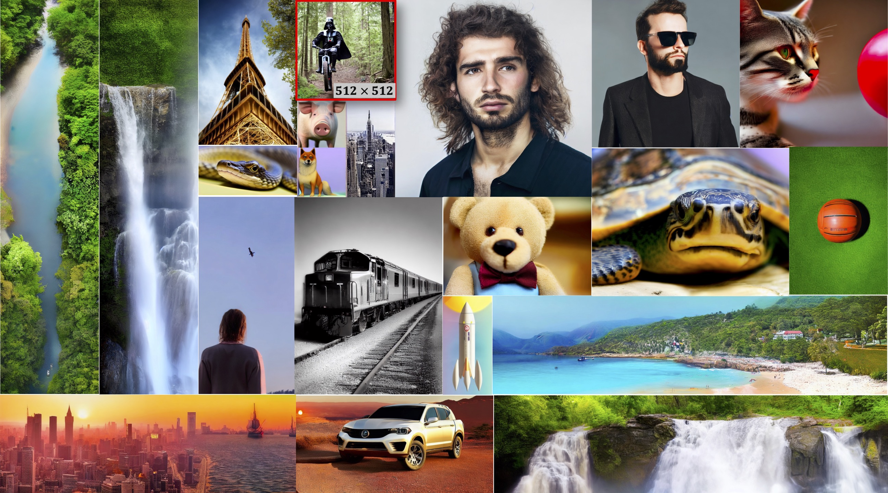

# ElasticDiffusion: Training-free Arbitrary Size Image Generation
[](https://elasticdiffusion.github.io/)
[](https://arxiv.org/abs/2311.18822)
[](https://replicate.com/moayedhajiali/elasticdiffusion)
<!-- [](TODO) -->



### ElasticDiffusion: Training-free Arbitrary Size Image Generation (arXiv 2023)
<div align="justify">
<b>Abstract</b>: Diffusion models have revolutionized image generation in recent years, yet they are still limited to a few sizes and aspect ratios. We propose ElasticDiffusion, a novel training-free decoding method that enables pretrained text-to-image diffusion models to generate images with various sizes. ElasticDiffusion attempts to decouple the generation trajectory of a pretrained model into local and global signals. The local signal controls low-level pixel information and can be estimated on local patches, while the global signal is used to maintain overall structural consistency and is estimated with a reference image. We test our method on CelebA-HQ (faces) and LAION-COCO (objects/indoor/outdoor scenes). Our experiments and qualitative results show superior image coherence quality across aspect ratios compared to MultiDiffusion and the standard decoding strategy of Stable Diffusion. For more details, please visit our <a href='https://elasticdiffusion.github.io/'>project webpage</a> or read our 
<a href='https://arxiv.org/abs/2311.18822'>paper</a>.
</div> 
<br>

# Setup
Initialize a [conda](https://docs.conda.io/en/latest) environment named elasticdiffusion by running:
```
conda env create -f environment.yaml
conda activate elasticdiffusion
```
This implementation should also work fine on an environment initalized for [stable diffusion](https://github.com/CompVis/stable-diffusion?tab=readme-ov-file). Just make sure to install [gradio](https://www.gradio.app/docs/examples) to be able to use the demo by running:
```
pip install gradio==4.7.1
```
<br>

# Replicate Demo
You may try Text2Image generation using Stable Diffusion XL as the base model at [](https://replicate.com/moayedhajiali/elasticdiffusion). 
- Please use the recommended hyper-parameters for each target resolution as indicated by the provided examples, please follow our hyper-parameters guide below.
- The current implementation is restricted to 2X the training resolution (i.e up to 2048 for Stable Diffusion XL)

<br>

# Gradio Demo
We provide a gradio UI for our method. To access the demo, run the following command after seting up ElasticDiffusion dependencies:
```
python app_gradio.py
```

<figure>
   
   <figcaption><center>Screenshot from ElasticDiffusion Gradio Demo </center></figcaption>
</figure>
<br>

# Text2Image 
You can import ElasticDiffusion and run it directly through the following command:

```
from elastic_diffusion import ElasticDiffusio
pipe = ElasticDiffusion(device=torch.device('cuda'), sd_version='XL1.0',
                       view_batch_size=16, torch_dtype=torch.float32) 

prompt = "An astronaut riding a corgi on the moon"
negative_prompt = "blurry, ugly, poorly drawn, deformed"

images, verbose_info = pipe.generate_image(prompts=prompt,
                        negative_prompts=negative_prompt,
                        height=1024, width=2048, 
                        num_inference_steps=50, 
                        guidance_scale=10.0, 
                        resampling_steps=7,
                        drop_p=0.7,
                        rrg_init_weight=1000,
                        cosine_scale=10)
```
- Supported stable diffusion versions (`sd_version`) are ['1.4', '1.5', '2.0', '2.1', 'XL1.0'], you may also pass a custom HuggingFace model key.
- Best results are achieved with Stable Diffusion XL (`XL1.0`).
- For lower memeory constrains, use a lower `view_batch_size` and `torch_dtype=torch.float16`.
- The current implementation is restricted to 2X the training resolution of the base diffusion model.
- Our method is sensitive to the hyper-parameters and different resolutions requires different hyper-parameters for best results. Please see our hyper-paramer selection guide below.

## Hyper-parameters
- `resampling_steps`:
  Controls the number of resampling steps to increase the global content resolution. Typically, a higher value results in sharper images but would increase the inference time substraintally. 
- `new_p`:
  Controls the percentage of pixels sampled at every resampling step. A lower value increases the resolution of the global content at a higher rate but might result in artifacts. We recommend setting `new_p` to 0.3.
- `rrg_init_weight`:
  The inital scale of the reduced-resolution guidance. A higher value helps eliminating emergying artifacts but results in blurier images. 
- `cosine_scale`:
  Specifies the decreasing rate of the reduced-resolution guidance scale. A higher values leads to more rapid decrease. The combination of this hyper-parameter and `rrg_init_weight` are used to control the harpness-artifacts tradeoff.


## Citation
If you find this paper useful in your research, please consider citing:
```
@misc{hajiali2023elasticdiffusion,
    title={ElasticDiffusion: Training-free Arbitrary Size Image Generation}, 
    author={Moayed Haji-Ali and Guha Balakrishnan and Vicente Ordonez},
    year={2023},
    eprint={2311.18822},
    archivePrefix={arXiv},
    primaryClass={cs.CV}}
```